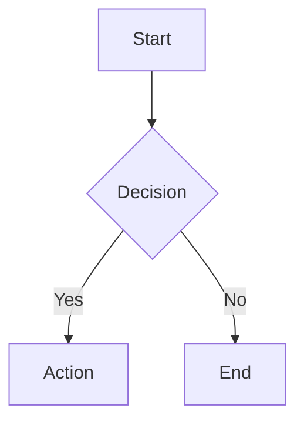

# Diagram

Render diagrams using Mermaid.js syntax. Diagrams are rendered client-side.

## Usage

Use the `mermaid` code fence with Mermaid syntax.

````markdown

````

## Example


## API Reference

```type-table
# Diagram Properties
syntax | string | required | Valid Mermaid.js diagram syntax
```
