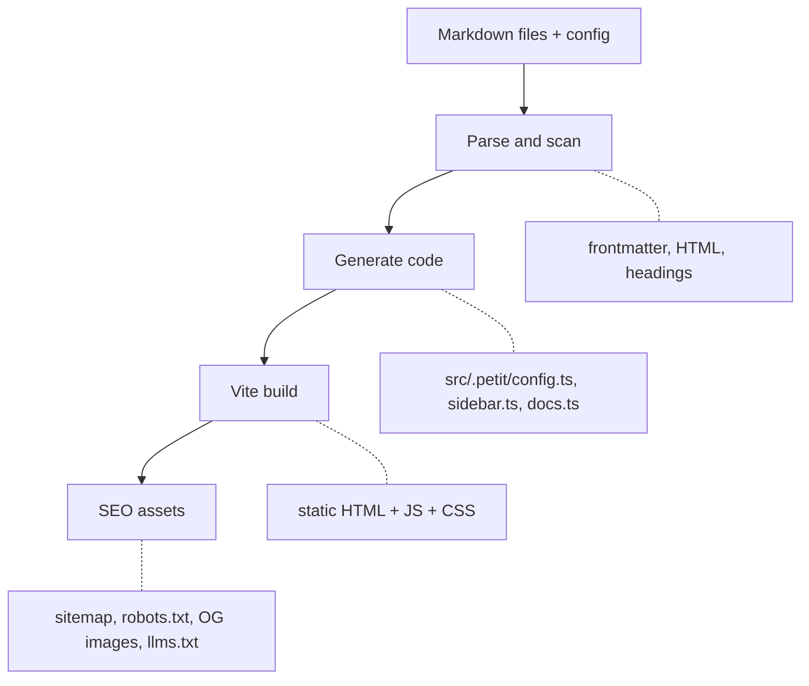

Petit is a static documentation generator built on Vite and
TanStack Start. It reads your markdown, generates a React app
with full-text search, and outputs static files you can host
anywhere. This page explains what happens at each stage.

## The big picture

When you run `petit dev` or `petit build`, the pipeline flows
through four stages:



## Markdown processing

Petit uses a unified/remark/rehype pipeline to transform your
markdown into HTML.

The processing chain runs in this order:

1. **gray-matter** extracts YAML frontmatter (title, description,
   order, draft)
2. **remark-parse** turns markdown into an AST
3. **remark-gfm** adds GitHub Flavored Markdown (tables,
   strikethrough, task lists)
4. **remark-mdx** enables MDX syntax support
5. **remark-rehype** converts the markdown AST to an HTML AST
6. **rehype-slug** adds `id` attributes to headings
7. **rehype-autolink-headings** makes headings clickable
8. **rehype-shiki** applies syntax highlighting to code blocks
   using the theme's Shiki configuration
9. **rehype-stringify** serializes the HTML AST to a string

Additional plugins handle math expressions (remark-math +
rehype-katex), callout blocks, video embeds, and theme-aware
images.

Custom rehype plugins handle Petit-specific components like
install tabs, type tables, cards, steps, accordions, tabs, and
mermaid diagrams. These plugins detect special code fence
languages and transform them into interactive HTML.

## The Vite plugin

The core of Petit is a Vite plugin that bridges your markdown
files and the React frontend.

During startup, the plugin:

1. Walks up from the Vite root to find `petit.config.json`
2. Loads and validates the config with Zod
3. Scans sidebar directories for `.md` and `.mdx` files
4. Parses every document through the markdown pipeline
5. Writes generated TypeScript files to `src/.petit/`

The generated files are regular TypeScript modules that the
React app imports directly:

| File | Contents |
|------|----------|
| `config.ts` | Site title, theme, layout settings, siteUrl |
| `sidebar.ts` | Categories and entries with labels, slugs, draft status |
| `docs.ts` | All parsed docs: HTML, raw markdown, frontmatter, headings |
| `theme.css` | CSS variables for colors, fonts, and prose styling |
| `error.ts` | Config validation error or null |
| `search.ts` | Serialized Orama search index with all page and heading entries |

In dev mode, the plugin watches your docs directory and config
file. When you save a change, it rebuilds the state and rewrites
the generated files. Vite's HMR picks up the changes and updates
the browser. The debounce interval is 300ms to avoid excessive
rebuilds during rapid edits.

## Search

Full-text search is powered by Orama and runs entirely in the
browser. No server-side search infrastructure is needed.

At build time, Petit strips HTML tags from every document's
rendered output and indexes the plain text along with the title,
description, slug, and category. The search index is serialized
to JSON and shipped as part of the client bundle.

On the client, the index is hydrated into a live Orama database.
Search queries run locally with no network requests, which keeps
results fast regardless of hosting infrastructure.

## Theme system

Themes define colors using oklch values, font stacks, Shiki
code highlighting themes, and prose typography settings. The
default theme ships with both light and dark schemes.

At build time, the theme definition is converted into CSS custom
properties and written to `src/.petit/theme.css`. The frontend
reads these variables for all styling, which means changing a
theme takes effect across every component without modifying React
code.

You can override individual CSS variables per scheme using the
`themeOverrides` config option.

## Build pipeline

The `petit build` command runs through these steps:

```steps
# Load and scan
Reads your config and scans every sidebar directory for `.md`
and `.mdx` files. Draft pages are skipped.

# Parse markdown
Runs documents through the remark/rehype pipeline to produce
HTML, extract headings, and process components. Unchanged files
are served from cache for faster rebuilds.

# Build search index
Strips HTML from rendered output and indexes the plain text with
Orama for client-side full-text search.

# Write data
Writes `.petit-data.json` with all parsed docs, sidebar structure,
and config for the Vite plugin to consume.

# Generate SEO assets
If `siteUrl` is configured, generates sitemap.xml, robots.txt,
OG images, llms.txt, llms-full.md, and individual .md files.

# Vite build
Runs `vite build` to produce the final static HTML, JS, and CSS.
```

The output is a standard static site. HTML pages are pre-rendered
via TanStack Start's SSR, and the client-side React app hydrates
for interactive features like search, theme switching, and code
block copy buttons.

## Dev vs production

| Aspect | Dev | Production |
|--------|-----|------------|
| Markdown parsing | On startup + watch | Once at build time |
| Search index | Rebuilt on changes | Built once, serialized |
| OG images | Skipped (too slow) | Generated as PNGs |
| .md endpoints | Served from memory | Static files in public/ |
| Theme CSS | Written to src/.petit/ | Bundled by Vite |
| HMR | Yes (300ms debounce) | N/A |
